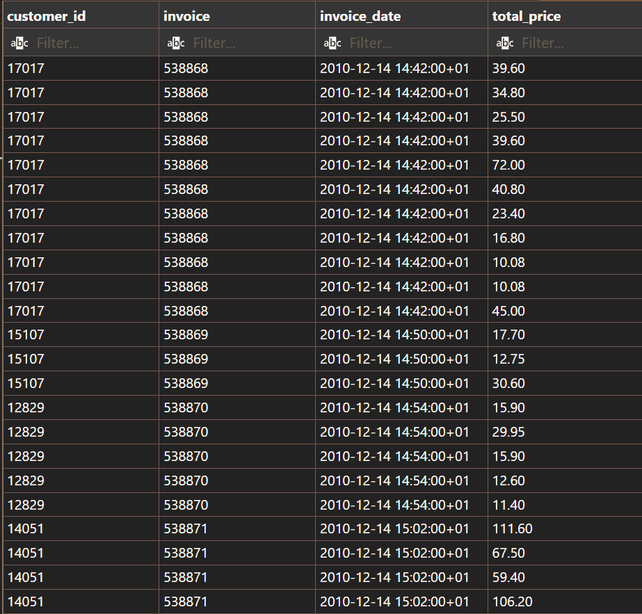
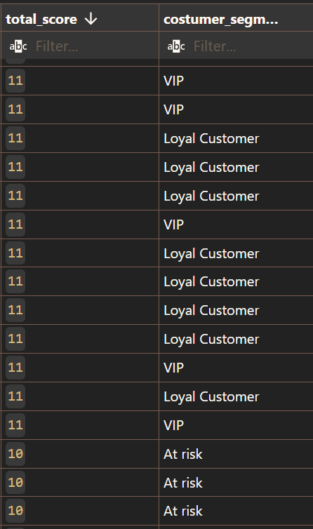
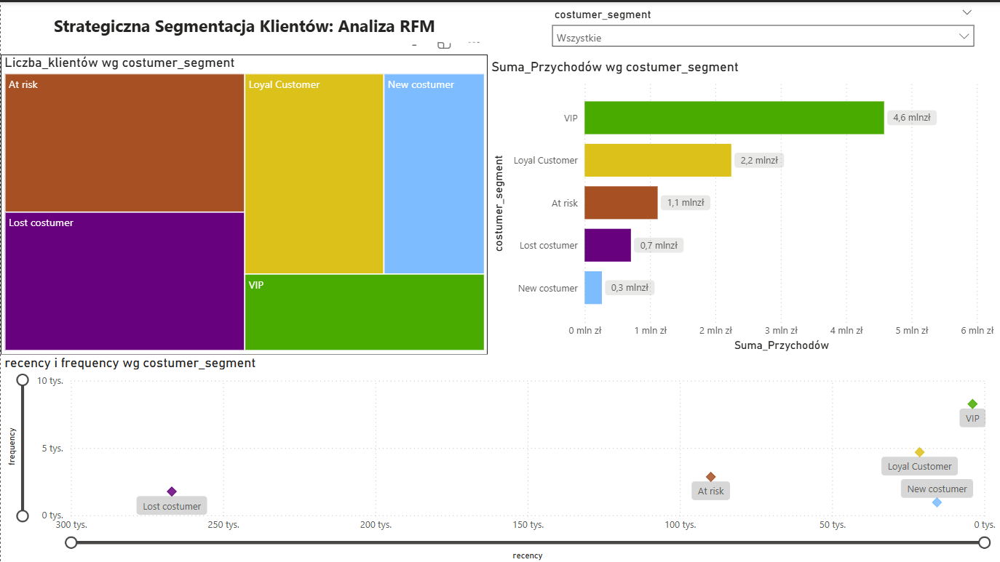
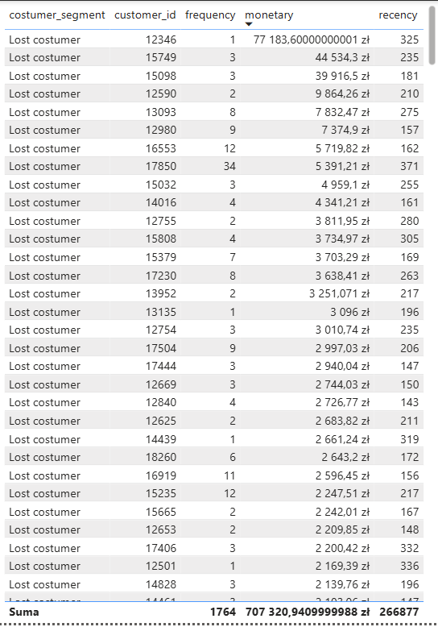

## Segmentacja Klientów metodą RFM
## 1. Cel Projektu
Celem projektu było przeprowadzenie zaawansowanej segmentacji bazy klientów sklepu online w celu optymalizacji działań marketingowych. Wykorzystano model RFM (Recency, Frequency, Monetary), który pozwala sklasyfikować klientów na podstawie ich realnych zachowań zakupowych.

## 2. Architektura Rozwiązania
Projekt został zrealizowany w architekturze ETL (Extract, Transform, Load) w bazie danych, co zapewnia wysoką wydajność i spójność danych.

* Źródło danych: Online Retail II Data Set (Kaggle).

* Silnik bazy danych: PostgreSQL.

* Warstwa wizualizacji: Power BI.

## 3. Etap I: Transformacja i Czyszczenie Danych (SQL)
Zastosowano widok SQL (online_retail), który przygotował surowe dane do analizy poprzez:

* Konwersję typów danych (naprawa formatu daty MM/DD/YY).

* Usunięcie rekordów bez identyfikatora klienta (customer_id).

* Odfiltrowanie zwrotów (wartości ujemne) oraz błędów systemowych (cena = 0).

## 4. Etap II: Logika Biznesowa (SQL CTE & NTILE)
Kluczowym elementem projektu jest widok rfm_analysis, który wykorzystuje Common Table Expressions (CTE) do wielostopniowych obliczeń:

* Metryki: Wyliczenie liczby dni od ostatniego zakupu (R), unikalnej liczby faktur (F) oraz sumy wydatków (M).

* Scoring: Zastosowanie funkcji okna NTILE(4) do przypisania klientom punktów  1-4.

Segmentacja: Użycie instrukcji CASE WHEN do zdefiniowania 6 segmentów biznesowych:

* VIP: Najwyższa aktywność i wydatki.

* Loyal Customers: Regularnie kupujący.

* New Customers: Świeże zakupy, niska częstotliwość.

* At Risk: Dawni klienci, którzy przestali kupować.

* Lost Customers: Najniższa punktacja.

* Standard: Pozostali.
* 

## 5. Etap III: Wizualizacja i Analiza (Power BI)
Dashboard: Wykorzystanie Treemap do pokazania struktury segmentów oraz Scatter Chart do wizualizacji rozkładu klientów.

Miary DAX: Wdrożenie  miar takich jak CALCULATE z funkcją ALL do obliczania procentowego udziału segmentów oraz bezpiecznego dzielenia DIVIDE.

Interaktywność: Implementacja funkcji Drill-through, pozwalającej na przejście z poziomu wykresu do szczegółowej listy klientów wybranego segmentu.
* 

## 6. Wnioski i Rekomendacje
* Segment VIP: Mimo że stanowią mniejszość populacji, generują największy procent przychodu. Rekomendacja: Program lojalnościowy Premium.

* Segment At Risk: Wymaga natychmiastowej reakcji, aby zapobiec ich przejściu do grupy "Lost".

* Segment New: Wysoki potencjał do konwersji na lojalnych klientów.
